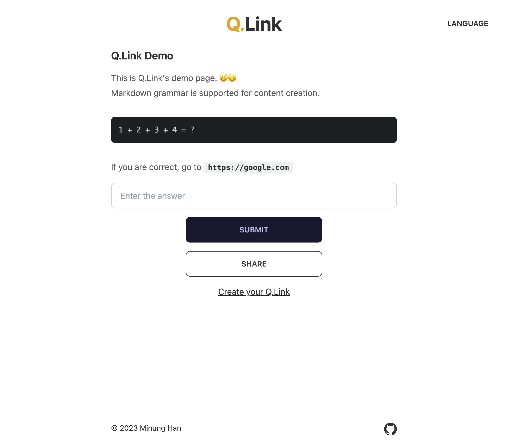
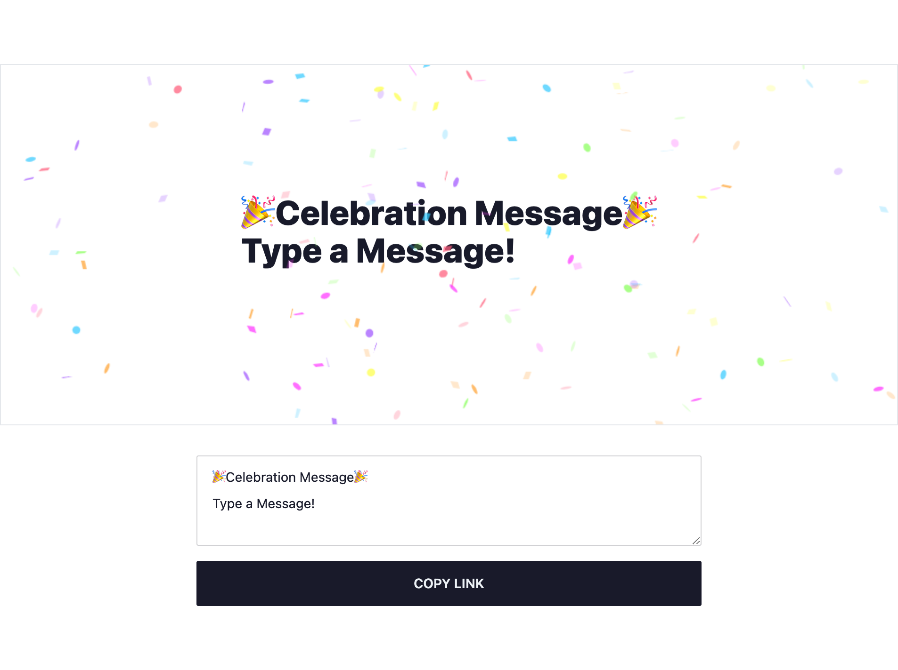
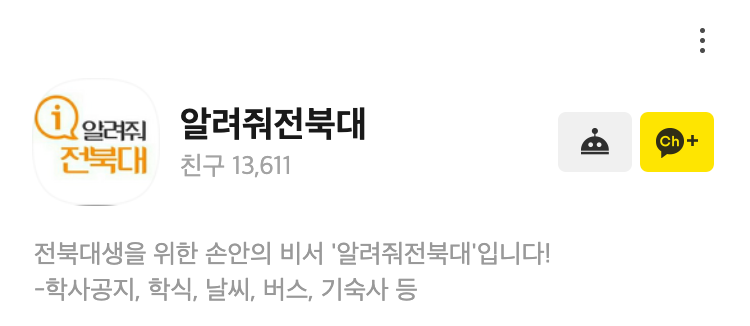

2022년의 나는 어떤 성장을 했는가를 되돌아보면 개인적으로는 여러 사이드 프로젝트 등을 통해 기술적인 성장을, 회사에서는 팀 리딩을 통해 소프트 스킬 역량이 대폭 상승한 한 해로 생각된다.

하지만 하반기에는 회사에서의 성장 밸런스가 무너진 느낌인데  
혼자서 주어진 목표를 달성하기만 하면 되는 엔지니어에서  
몇 명의 팀원들과 함께 목표를 달성해나가는 작은 엔지니어 팀장이었다가  
지금은 규모가 더 커져 소규모의 회사를 이끄는 작은 대표의 느낌이 되었다.

그렇다 보니 현재 프로세스나 리소스적으로 부족한 부분을 해결하기 위해 여러 역할을 자처해서 할 수 밖에 없었고 그 과정에서 엔지니어링적인 부분은 큰 단위의 의사결정 과정에서만 참여하고 그 이하의 역할들은 대부분 다른 팀원들이 담당해주게 되었다.

나는 여전히 내가 엔지니어로서 많은 역할을 하기를 바라기 때문에  
올해는 이를 해결하기 위한 조직 구조와 프로세스를 만들고, 나의 밸런스를 다시 되찾는 게 목표이다.

팀 리딩에 대한 부분은 [이전에 작성한 글](/posts/7/2022년-회고-팀-리더편)에 작성해 두었고  
여기에는 개인적인 성장인 사이드 프로젝트들에 대한 내용을 작성하려고 한다.

## 사이드 프로젝트

2022년에는 많은 사람들이 사용할 수 있는 서비스를 만드는 것을 목표로 했다.
단순히 기술을 사용하거나 만드는 것만으로는 흥미가 너무 떨어져서 실제로 배포 후 사용될 수 있도록 하는 것까지 목표로 했고, 이 과정에서 재밌는 경험도 많이 하게 되었다.

이번 회고에서 언급할 2022년 만들어진 서비스 일부

- Q.Link - Hide your link behind a simple quiz.
- Moon.svg - Add real-time moon on your github!
- Celebration - Adds visual effects to your messages, allowing you to share them with others in a fun and engaging way
- Tip Tap - Select a mode, tap on the screen! Tip-Tap is a collection of simple games that an play with fingers for Drawing Lots.
- DDay.widget - Add D-Day widget to anywhere, such as your Github Profile, Notion, etc
- 9oormthon-badge - 4기 구름톤을 위한 한정판 배지
- Live Comments - 웹페이지의 요소들에 댓글을 달고, 동료에게 링크를 공유하세요! Live Comments는 화면 해상도와 상관없이 동료와 내가 같은 Element를 보고 실시간 댓글 주고받기가 가능합니다.
- Peer Voice - 웹페이지에서 친구와 간단하게 통화해보세요!

### Q.Link - Hide your link behind a simple quiz.

[](https://q-link.minung.dev)

- [Site »](https://q-link.minung.dev)
- [Demo »](https://q-link.minung.dev/links/62825d42dad9a9d8d439aa54)
- [Github »](https://github.com/hmu332233/q-link)
- [Product Hunt »](https://www.producthunt.com/posts/q-link)

**실제 링크로 이동하기 전에 간단한 퀴즈를 사이에 끼워넣는다는 컨셉의 서비스**

링크 공유자의 생일을 맞추면 모바일 청첩장으로 이동한다던지, 간단한 면접 문제를 맞추면 회사 공고 페이지로 이동한다던지 등 가볍고 재미 요소에서 만든 서비스로 개인적으로 2022년에 가장 좋아하는 서비스이다.

아이디어가 사람들에게 공감이 되었는지 **Product Hunt의 Product of the Day Top 5** 안에 선정되었는데 이정도되니 외국인들이 먼저 서비스에 기여를 하고 싶다고 찾아오기까지 했다.

말레이시아 학생 친구와 터키인 뉴클리어 엔지니어 친구가 본인들 나라의 언어를 추가하고 싶다고 PR 및 메일을 보내왔고
이들과 소통하여 현재 **한국어, 영어, 터키어, 말레이시아어 4개 언어를 지원하는 서비스**가 되었다.

심지어 터키인 친구는 언어 기여 외에도 본인의 피드백을 영상으로 녹화해서 직접 보내주기까지했다 ㅋㅋ
갑자기 듣기 평가를 하는 느낌이긴했지만 덕분에 어색했던 영문 표현을 몇 개 바꿀 수 있어서 참 좋았다 👏👏

**기술적으로 경험 / 기억에 남는 것**

Nextjs로 진행한 두번째 프로젝트인데
api까지 모두 Nextjs로 해결해보는 목적으로 nextjs + mongodb 스텍을 선택해서 진행했다. 디자인은 내가 최근 가장 애용하는 tailwind + daisyui

처음에는 vercel에 배포하여 api까지 모두 관리하려고 했으나, 그 때 당시 상황으론 첫 진입이 느려서 aws에 api 서버를 별도로 만들어두는 것으로 진행하게 되었다.

그 이유는 배포 당시의 vercel 무료 계정은 Serverless Functions의 리전을 선택할 수 없어서 워싱턴이 기본이였는데

```jsx
클라이언트(한국) → Serverless Functions(미국) → mongodb(한국) → Serverless Functions(미국) → 클라이언트(한국)
```

내 mongodb는 한국 리전에 있었기 때문에 api 요청이 위와 같은 흐름을 타게되었고, 이와 더불어 cold start인 것까지 한 몫해서 첫 페이지 진입 시간이 너무 길어졌었다. 그래서 api 서버를 aws로 별도로 띄워서 적어도 내 서비스 내의 레이턴시를 줄이려고했다.

근데 이 글을 쓰는 지금은 Edge Function이 Vercel에 추가되면서 무료 계정들에 Serverless Functions 리전을 자유롭게 선택할 수 있도록 풀어주었기 때문에 얼마전에 aws 서버를 내리고 Vercel 내에서 해결할 수 있도록 다시 변경했다.

여러가지로 많은 경험을 해준 서비스라 굉장히 좋아한다. 😀

### Moon.svg - Add real-time moon on your github!

<div class="flex justify-center">
   <a href="https://moon-svg.minung.dev">
    
   </a>
   <a href="https://moon-svg.minung.dev">
    
   </a>
</div>

- [Site »](https://moon-svg.minung.dev/)
- [Github »](https://github.com/hmu332233/moon.svg)

**Github Profile Readme나 Notion 등에 실시간으로 변경되는 달을 추가할 수 있는 서비스**

이 서비스도 생각보다 사람들이 많이 사용해줘서 그런지 현재 **Github Star가 26개**이다 👏👏  
위의 예시로 보여지고 있는 달 모양도 현재 실제 달의 모양이다. 특정한 날짜를 지정할 수도 있어서 특별한 날에 대한 달 모양으로 고정할 수도 있다. (태어난 날, 기념일 등등)

이런 아이디어를 더 확장해서 특별한 날의 달 모양을 사람들끼리 서로 쉽게 공유하는 서비스로 좀 더 확장해보려는 계획을 가지고 있다.

**기술적으로 경험 / 기억에 남는 것**

시작은 단순히 Github Profile Readme에 추가할 수 있는 Badge를 직접 만들어보고 싶어서 시작한 프로젝트인데 어떻게 해야 Github Profile에 이미지를 자유롭게 커스텀해서 보내줄 수 있는 건지 방법을 몰랐기 때문에 다른 사람들 오픈소스 뜯어보면서 연구를 했다.

덕분에 어떤 방식으로 커스텀된 Badge를 만들 수 있는지, Github은 어디까지 허용되는지 등을 알 수 있었다. 그리고 사내의 동료 개발자가 여기에 테마를 추가해주기도 했다.  
개인적으로는 내가 만든 테마보다 더 이뻐서 잘 사용하고 있다.

다음 목표로는 이를 og:image로 만들 수 있도록 해서 사람들끼리 공유를 자유롭게 하도록 하는 서비스로 탈바꿈하고 싶은데 아마 다시 흥미가 생길때 찾아와서 진행하게 될 것 같다

### Celebration - Adds visual effects to your messages, allowing you to share them with others in a fun and engaging way

[](https://celebration.minung.dev)

- [Site »](https://celebration.minung.dev/)
- [Github »](https://github.com/hmu332233/celebration)

**메세지를 입력하고 이를 공유하면 화면에 파티 폭죽 이펙트와 함께 문구가 노출되는 굉장히 심플한 서비스**

Q.Link를 만드는 과정에서 링크 이동이 아니라 단순히 퀴즈만 내고 싶은 사람들을 위해서 별도로 축하만 하는 서비스를 만들었다. 🎉  
여기에 좀 더 아이디어를 더해서 유저가 입력한 데이터를 기반으로 만들어진 **페이지가
그대로 썸네일이 되어서 og:image로 표시**되고 이걸 사람들이 공유하도록 만들어보고 싶어서 시작하게 되었다.

**기술적으로 경험 / 기억에 남는 것**

**어떻게 해야 실제 페이지를 썸네일 이미지로 서버에서 만들어내고 이를 og:image로 보내줄 수 있는가**를 해결하는게 이 서비스의 핵심이였는데 구현하면서 사용했던 방식은 puppeteer를 이용하여 html로 화면을 그리고 이를 스크린샷으로 찍어 파일로 만들고 이를 서빙하는 방법이다.

하지만 이 방식은 image가 생성되기까지 시간이 걸리기 때문에 og:image를 표시해주는 클라이언트들의 응답 시간 제한 정책 내에 image를 응답하지 못하면 og:image가 영영 표시되지 못하는 단점이 있다. 😞

글을 작성하는 지금은 Vercel에 [Satori](https://github.com/vercel/satori)라는 비슷한 역할을 해주는 라이브러리가 추후에는 이 라이브러리를 한번 사용해볼까 생각해보고 있다.

### Tip Tap - Select a mode, tap on the screen! Tip-Tap is a collection of simple games that an play with fingers for Drawing Lots.

<div class="flex justify-center">
<iframe width="560" height="315" src="https://www.youtube.com/embed/ZwBpfGNzwT4?controls=0" title="YouTube video player" frameborder="0" allow="accelerometer; autoplay; clipboard-write; encrypted-media; gyroscope; picture-in-picture; web-share" allowfullscreen></iframe>
</div>

- [Site »](https://tip-tap.minung.dev/)
- [Github »](https://github.com/hmu332233/tip-tap)

**손가락만을 이용해 뽑기/팀 선정/순서 정하기 등 간단한 게임을 제공하는 서비스**

이미 어플로 여럿 보이는 서비스인데, 웹버전으로 간단하게 쓰고 싶어서 시작한 프로젝트이다.
회사에서 내기 등을 할 때 굉장히 자주 사용하고 있는데 사람들끼리 분위기도 좋아지고 동료 중 한명은 본인이 여행 갔을때 게스트 하우스 사람들끼리 설거지 내기를 할때도 사용했다고 한다. 😀

**기술적으로 경험 / 기억에 남는 것**.

터치를 제어하는 것 자체는 어려운건 아니였는데 이를 React state로 관리해보려는 시도에서 고민 포인트가 살짝 있었고 **기기마다 최대 터치수가 정해져있다는 것**을 새롭게 알게되었다.  
Info) 아이폰이 최대 터치수 5개로 주변 기기 중엔 제일 적었다.

### Live Comments - 웹페이지의 요소들에 댓글을 달고, 동료에게 링크를 공유하세요! Live Comments는 화면 해상도와 상관없이 동료와 내가 같은 Element를 보고 실시간 댓글 주고받기가 가능합니다.

<iframe width="560" height="315" src="https://www.youtube.com/embed/NgxK32xA_fo" title="YouTube video player" frameborder="0" allow="accelerometer; autoplay; clipboard-write; encrypted-media; gyroscope; picture-in-picture; web-share" allowfullscreen></iframe>

- [Site »](https://chrome.google.com/webstore/detail/live-comments/mljdkcnhfdfgpgndnhallgghfmnnlemg)
- [Github »](https://github.com/hmu332233/live-comments)

**URL을 통해 익스텐션 내에서 같은 사이트를 바라보며 실시간으로 요소들에 대해서 댓글을 주고 받을 수 있는 서비스**

디자이너와 협업하면서 피그마의 Comment 기능을 굉장히 자주 쓰는데 실제 배포된 환경 또는 다른 웹 페이지등에서도 Comment를 보면서 실시간으로 소통할 수 있으면 좋겠다는 생각이 들어서 시작하게 된 프로젝트이다.

실제 유저들이 많이 사용할 수 있도록 홍보를 하진 않았지만 지금도 이 아이디어는 굉장히 좋다고 생각한다. Vercel에서도 비슷한 걸 내놨던데 나는 오픈소스로써 Notion 등과 결합하여 언젠가는 다시 되살려보고 싶은 서비스이다.

**기술적으로 경험 / 기억에 남는 것**

이용자간에 실시간으로 서로가 바라보는 Element 알아내서 전송할 수 있어야했는데 이 과정에서 WebRTC가 사용되었다.

또한 이용자 간에 서로 접속이 필요했기 때문에 도메인이 붙은 고유한 URL을 통해 공유를 하면서도
이게 웹사이트가 아니라 익스텐션 페이지를 띄우면서 연결시킬 수 있는 시스템을 만들어야했다. **공유 URL을 통한 페이지와 브라우저에 설치된 익스텐션 간의 소통 구조**를 만들어낸 이 경험이 굉장히 재밌었던 기억으로 남아있다.  
그래서 이 시스템과 아이디어를 다른 형태로 또 사용해보고 싶다는 생각이 있다. 🤔

### DDay.widget - Add D-Day widget to anywhere, such as your Github Profile, Notion, etc

<div class="flex justify-center">
  <a href="https://dday-widget.minung.dev">
    
  </a>
</div>

- [Site »](https://dday-svg.minung.dev/)
- [Github »](https://github.com/hmu332233/dday.widget)

**Github Profile Readme나 Notion 등에 실시간으로 변경되는 디데이 위젯을 추가할 수 있는 서비스**

Moon.svg를 통해 웹 위젯을 만들 수 있는 능력?을 얻은 이후 다른 방식의 아이디어로 접근해보려고 했던 서비스이다. 예전부터 노션에 디데이 위젯을 달고 싶다는 생각을 했는데 만들 수 있는 능력이 생겼으니 바로 진행했었다.

**기술적으로 경험 / 기억에 남는 것**

Moon.svg와 같은 기술 방식으로 구현한 프로젝트이지만 큰 차이는 svg로만 구성된건 아니고 내부에 css와 html 다른 태그가 포함되어있다는 것이다.

svg 태그 중 foreignObject 이라는 태그가 있는데 이 태그를 사용하면 svg 내에서 일부 html, css를 사용할 수 있다는 것을 알게되었고 이를 이용해서 좀 더 편하게 구현할 수 있었다.

### 9oormthon-badge - 4기 구름톤을 위한 한정판 배지

<div class="flex justify-center">
  <a href="https://9oormthon-badge.minung.dev">
    
  </a>
</div>

- [Site »](https://9oormthon-badge.minung.dev/)
- [Github »](https://github.com/hmu332233/unofficial-9oormthon-badge)

구름톤의 멘토로 참여를 했는데, 참여자들이 열정적으로 진행하는 것을 보니 나도 참을 수 없어서 즉석에서 만든 서비스이다.

**기술적으로 경험 / 기억에 남는 것**

Moon.svg, DDay.widget과 같은 기술 방식으로 구현 방식만 바꾼거라 기술적으로 별로 특별한 건 없지만 참가자들의 열정에 나도 열정이 불타올랐던 좋은 기억의 프로젝트이다. 🔥🔥

초기 아이디어는 구름톤 기간에만 오픈되어있고 그 이후에는 더이상 만들어지지 못하는 것까지 하려고 했었으나 구현하려면 어쨌든 이 기간에만 만들어진 배지라는 것을 어딘가에는 기록을 해놔야했기 때문에 가볍게 빠르게 구현하는 상황에서는 최종 스펙에서는 제외시켰다.

이걸 쓰다보니 Vercel에 새로 오픈된 Storage 서비스들 사용해보는 김에 만들어보는 것도 재밌겠다는 생각이 든다.

### 알려줘전북대

[](https://pf.kakao.com/_LffxoM)

- [Site »](https://pf.kakao.com/_LffxoM)
- [Github »](https://github.com/hmu332233/tip-tap)

어느새 **7년차에 돌입한 서비스**, 운영하면서 학생때 웹에 대한 전반적인 경험을 몰아서 할 수 있도록 만들어준 고마운 서비스이지만 현재는 사실상 별다른 유지보수는 하고 있지는 않다. 😓

여전히 많은 사람들이 이용해주고 있는 서비스라 감사하게 생각하고 있다.
코로나가 끝나면서 대면수업으로 대부분 전환되었기 때문에 이제 현재 상황에 맞춰서 한번 손볼때가 된 것 같기도하다.

## 마무리

이번에 언급된 대부분의 서비스들이 만들어진 날짜를 보니 대부분 상반기에 만들어졌다. 그만큼 하반기에는 별다른 서비스 오픈이 없었다는 건데 초반에 언급한 것처럼 하반기에는 여러 가지로 밸런스가 깨진 게 한몫한 것 같다.

내가 만들어 온 재밌는 아이디어들과 그것으로 경험했던 기술적 요소들을 이번 기회에 나열하다 보니 고작 1년 전임에도 불구하고 열정이 엄청났던 것 같아서 지금의 나도 과거의 나에게 새삼스레 자극을 받고 있다.

2023년에는 **Star 100개짜리 서비스를 만들어내겠다**는 버킷리스트를 작성한 게 있는데 이게 달성될 수 있도록 한 번 더 달려봐야겠다.
