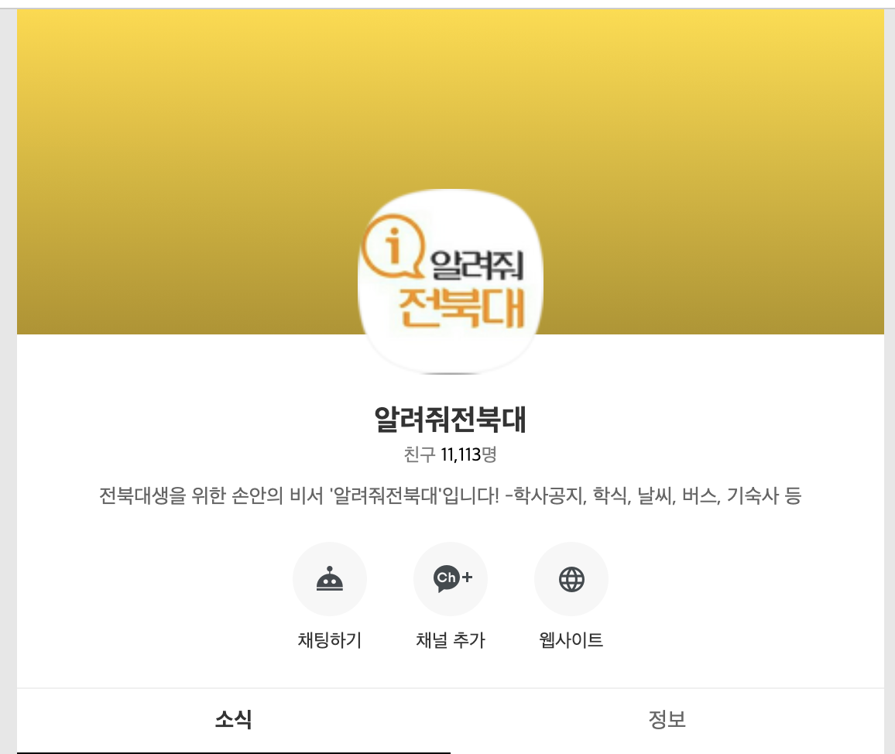
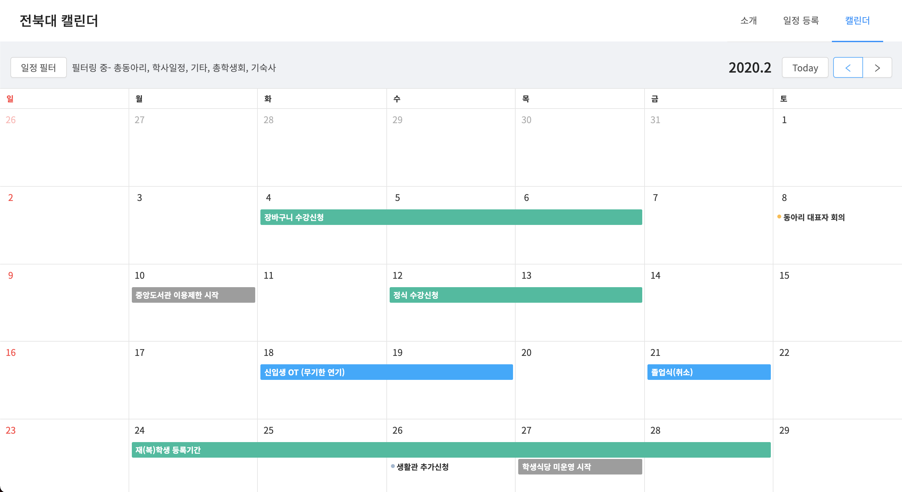
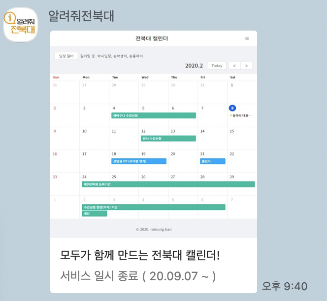
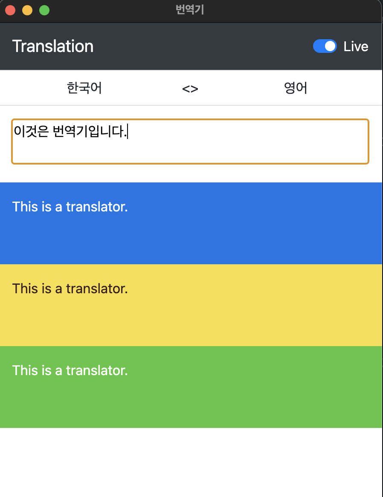

올 해는 드디어 21년으로 넘어가기전에 회고를 쓴다!

## 2020년의 나

2020년은 방황하는 해였던 것 같다.  
2019년까지는 끊임없이 무엇인가를 만들어냈었는데  
어느 순간부터 아이디어만 다를 뿐 같은 일을 반복하고 있다는 생각이 들어서  
끊임없이 무엇인가 만들어내던 행동을 멈추고 개발 외의 다른 취미를 해보기 시작했다.  
그렇게 단 한 번도 퇴근 후에 집의 PC가 안 켜진 적이 없었는데 요즘은 평일 내내 PC를 켜지 않는 상황도 몇 번 생기곤 했다.  
여기에는 반년간 주 6일로 일했던 것도 한몫했다.  

2020년은 뭔가 크게 성장을 한 것 같은 느낌이 부족해진 한 해이기도 하다.  
블로그에 회고를 쓰기 시작한 17년부터 매년 항상 1년 전의 나를 돌아보면  
크게 성장을 했다는 느낌이 들었는데  
올해는 크게 성장했다는 느낌이 들진 않는다.  
물론 1년이란 시간이 지났으니 무언가를 더 알게 되고 더 공부해보고 한 것은 맞지만  
이전과는 달리 크게 늘었다는 생각이 들진 않는다.

올 해 초부터 가장 고민을 많이 했던 것은 나의 개발자로서의 정체성이였다.  
`어떤 길을 걷는 개발자가 될 것 인가?`에 대한 질문을 계속해서 해나가고 있다.

제너럴리스트보다는 어느 한 분야의 스페셜리스트가 되어야하지 않을까? 하는 생각을 가지고 있었기 때문에  
3월달 쯤에 위와 같은 고민에 대해 백엔드를 이해할 수 있는 프론트엔드 개발자로 한번 정리를 해봤으나  
올 해까지 회사에서 해온 프로젝트들을 봐도 그렇고 내가 프론트엔드 분야만 흥미로워 하는 것도 아니라서 딱히 위의 단어로 나를 정리하지는 못할 것 같다.  
이 고민은 올해도 계속될 예정이다.

기술 스텍말고 재밌어하는 것으로 나를 정의해보자면 아래처럼 말할 수 있지 않을까  

- 서비스 개발자. 프론트엔드, 백엔드 가릴 것 없이 유저들에게 닿아있는 서비스를 개발하는 개발자.  
- 내가 사용하는 것들을 직접 만드는 것을 즐기는 개발자.

## 사이드 프로젝트

### 알려줘전북대

보통 매년 약 3000명이 친구추가를 새로하는 편이였는데 올 해는 거의 늘어나지 않았다.  
사용량의 약 80퍼는 학교 식단, 15퍼정도는 기숙사 관련 정보들인데  
올 해는 코로나 때문에 학생들이 학교를 나오지 않게 되면서 사용을 하지 않게 되어서  
친구 추가가 많이 되지 않은 것 같다. 실제로 사용량도 방학 수준으로 줄어들었다.  
다만 다행인 것은 카카오 챗봇에 사용량 제한이 생겼는데 코로나 덕분에(?) 사용량이 줄어들면서  
매달 사용량을 넘지 않게 되었다. 사용량이 원래대로 돌아간다면 무료로는 사용이 불가능해지기 때문에 이를 대체할 다른 방법을 생각해보는 중이다.

사용량이 줄어듬에 따라 기능을 추가하거나 구조적으로 무언가 변경하거나 하는 작업을 딱히 추가한 것은 없는데  
무료 크래딧을 쫓아다니느라 올 해에만 ncloud -> gcp -> aws로 옮기게 되었다.

전에는 모놀리스로 하나의 큰 앱이 모든걸 다하고 있었는데  
지금은 아직 최신화 되진 않았지만 [알려줘전북대 구조](https://blog-new.minung.dev/posts/3/%EC%95%8C%EB%A0%A4%EC%A4%98%EC%A0%84%EB%B6%81%EB%8C%80-%EA%B5%AC%EC%A1%B0)에 나와있듯이 여러 개의 앱으로 나눠져 있기 때문에 도커를 쓰고 있음에도 기본적인 환경 셋팅을 해줘야할 것들이 있어서 조금은 귀찮아지고 있다.
dpkg를 이용해서 기본적인 것들 설치하는 거랑 각 레포들에서 클론 받고 환경변수 파일 셋팅하고 도커 이미지 만들어주는 작업을 할 수 있는  
패키지를 하나 만들어서 이걸 통해서 다른 클라우드로 옮겨다니면 좋지 않을까 하고 생각해보고 있다.  
아마 조만간 심심해지면 해보지 않을까

### 전북대 캘린더

작년 회고 때 오픈하겠다고 목표로 걸어둔 [jbnu-calendar](https://github.com/hmu332233/jbnu-calendar), 일명 전북대 캘린더이다.  
모바일과 pc 중 어느 것을 우선으로 해야할지. 모양을 어떻게 되어야할지. 어떤 식으로 검색이 되어야 편할지 등등  
여러 고민을 하면서 프로토타입을 완성하고 3월에 야심차게 오픈을 했다.  
이미 알려줘전북대라는 플랫폼?을 소유하고 있기 때문에 홍보에는 문제가 전혀 없어서 서비스만 만들면 된다. 라고 생각하고 있었는데  
코로나로 인해서 알려줘전북대 사용량 자체가 줄어들 것이라고는 생각을 못했었다 ㅠㅠ..  

오픈 이후 약 한 달 동안 열심히 관리를 했는데 결국 너무 적은 사용량으로 현재는 내린 상태이다.  
하지만 언젠간 다시 되살려야지 하는 마음을 가지고 있다.  
캘린더이기 때문에 pc를 기준으로 우선 오픈했는데 홍보 수단이 모바일인만큼 다음에는 모바일 기준으로 먼저 만들어서 오픈할 예정이다.  

### 새 블로그 이전

블로그를 새로 이전했다.  
[https://blog.minung.dev](https://blog.minung.dev) -> [https://blog-new.minung.dev](https://blog-new.minung.dev)로 옮겼다.  

기존에는 jekyll 기반이였고 이번엔 gatsby 기반인데  
옮긴 이유는 jekyll를 사용할 때는 그냥 테마 템플릿을 가져와서 사용할 뿐이였지만  
gatsby react 기반이라 내가 직접 만들어볼 수 있겠다 싶어서 변경했다.  
디자인 시스템은 [tailwindcss](https://tailwindcss.com/)를 사용하고 있고 호스팅은 [netlify](https://www.netlify.com/)을 통해서 하고 있다.

특히 tailwindcss를 사용하고 매우 만족스러워하는 중인데  
bootstrap3, 4, antd 등과 같이 디자인 시스템이 포함된 여러 css 프레임워크나 컴포넌트 라이브러리등을 사용해봤지만  
그 중 제일 잘 만들어진 것 같다. 개인적으로는 bootstrap보다는 훨씬 더 직관적인 사용방법이 아닌가 생각한다.

react를 제외하고 모두 새로 해보는 것이였기 때문에 재밌게 만들었던 기억이 난다.
2021년의 계획 중에 하나로 이 블로그를 `gatsby-starter-minung`이라는 이름으로 정리해서 올려두려고 한다.

### 3사 번역기

구글, 네이버, 카카오 번역을 해주는 번역기.  
언젠가는 만들어야지 하던 건데 올 해 redux를 사용한 사이드 프로젝트를 하나 고르다가 생각나서 만들었다.  
만드는 김에 electron도 사용해서 맥용 앱으로도 만들어뒀다.

한미일 간 번역만 사용하고 있고 실시간 번역, 복사 등의 기능이 있다.
아 심지어 단축키도 있다.

[hotkeys](https://github.com/jaywcjlove/hotkeys)를 이용해서 단축키를 구현했는데
단축키 기능과 redux가 조합이 상당히 괜찮은 것 같다는 느낌을 받았다. redux를 이용해서 기능을 만들어두면
hotkeys에서는 해당 단축키 입력시 이를 실행하기만 해주면 되서 action을 트리거할 수 있는 수단에 단축키 하나만 추가한 느낌?

번역을 해야하는 일이 한번씩 생기는데 그 때마다 매우 요긴하게 잘 사용하고 있다.

### 그 외

**bs-grid-chrome-extension**  
bootstrap grid를 보기 편하게 만들어주는 크롬 익스텐션.  
github에 구버전의 코드가 공개되어 있길래 내 입맛에 맞게 변경해서 쓰고 있다.  
익스텐션의 코드와 깃헙에 올라온 코드가 동일한 버전이였다면 이슈 생성하고 pr을 날려볼 기회였는데 아쉽다.

**npx minung**  
[npm.minung](https://github.com/hmu332233/npm.minung) npm에 나를 소개할 수 있는 라이브러리를 올려뒀다.  
아직은 별 다른 아이디어가 없어서 간단하게 만들어뒀는데 앞으로 이것을 이용해서 내가 거쳐온 회사들이나 만든 주요 사이드 프로젝트들을 소개하면 재밌겠다 싶다.

## 기타

**요즘 관심 있게 보고 있는 것**

최근에는 nestjs와 typescript를 관심 있게 보고 있는 중이다.  
특히 typescript는 1분기에는 내 개인 프로젝트들에 몇몇 적용을 해보고  
괜찮다 싶으면 회사 내 일부 프로젝트들에 적용을 해보는 각을 보고 있다.

**회사**

올 해는 주로 결제와 정산 시스템을 담당하게 되었고  
리뉴얼을 진행했는데 koa 기반으로 프로젝트를 무에서 새로 만들게 되었다.  
기존의 코드는 결제 수단별로 코드를 복사해서 사용하는 급이였고 각 레이어 별로 로직들이 구분되지 않고 섞여있어서  
새로운 기능 추가나 결제 수단 추가에 많은 어려움을 겪었었다.  
이를 해결하기 위한 구조를 잡기 위해 노력했고, 나름대로 잘 되고 있는 것 같다.  
9월쯤에 리뉴얼된 버전으로 변경하고 현재까지 잘 돌아가는 중이다.  
다만 javascript 기반이기 때문에 잡혀진 구조를 강제하진 못하고 코드 리뷰등으로만 구조를 바로 잡을 수 있기 때문에  
내년에 이 앱에 typescript를 적용을 해보는 각을 보고 있다.

그 외에 기억나는 건  
이메일 전송 앱에 큐를 추가했는데 여러 큐를 조사해보다가 결국 bulljs를 선택하게 되었다.  
이것을 선택하게 된 이유에 대해서는 나중에 회사 차원에서 글을 쓸 수 있으면 좋지 않을까 생각해본다.

## 마무리?

2021년에는 나를 드러내는 활동을 해야겠다는 생각이 든다.  
그게 블로그 글이 되었던지, 아니면 지금처럼 만들어온 사이드 프로젝트들을 일반화 시켜서 생활코딩 같은 곳에 오픈하는 것도 좋을 것 같다.
음 모두의 캘린더를 생활코딩에 공개할 목적으로 만들면 어떨까?  
오.. 쓰다보니 괜찮은 것 같다.  
2021년 사이드 프로젝트 아이디어로 추가 완료